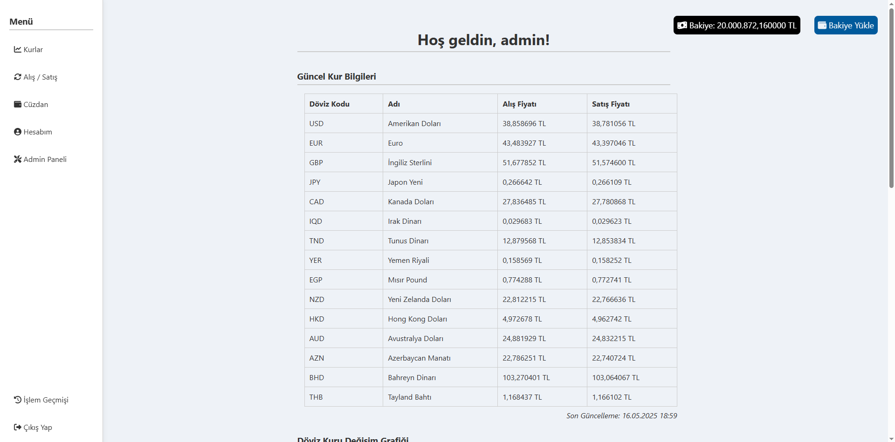
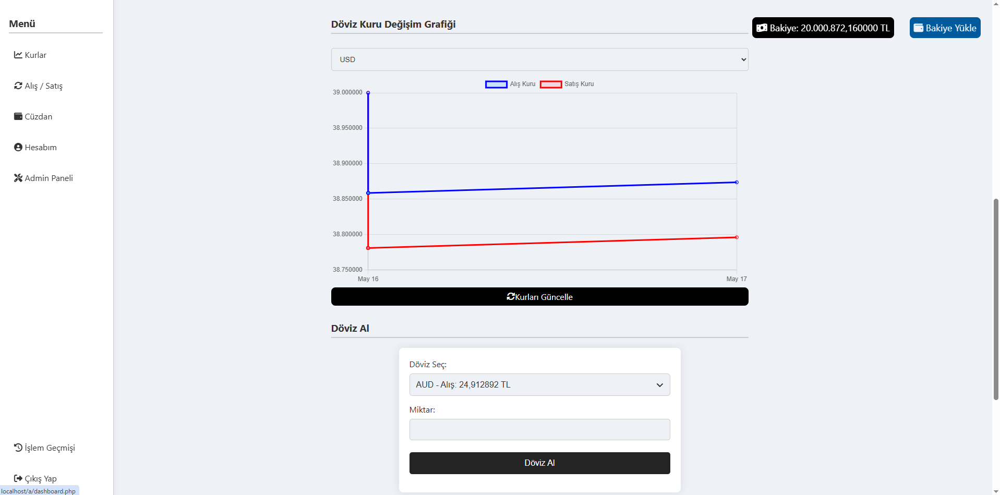

# Web-Based Currency Exchange Automation System

## 📌 Project Summary
This project is a web-based currency exchange automation system that enables users to:
- Deposit TRY using card information
- Buy and sell various currencies
- View current and historical exchange rates
- Track personal transaction and wallet history
- Use an admin panel for user balance management and currency control

## 🛠️ Development Environment
- Backend: PHP (Procedural)
- Frontend: HTML, CSS, JavaScript (Chart.js)
- Database: MySQL (managed via phpMyAdmin)
- Tools: VS Code, XAMPP

## 🚀 Installation & Setup
1. Clone this repository:
   ```
   git clone https://github.com/your-username/your-repo-name.git
   ```

2. Place the project folder in your XAMPP `htdocs` directory.

3. Start Apache and MySQL via XAMPP control panel.

4. Import the SQL file:
   - Open `phpMyAdmin`
   - Create a new database (e.g., `doviz_otomasyon`)
   - Import `42_sql_betikleri.txt`

5. Access the project in your browser:
   ```
   http://localhost/your-project-folder/
   ```

## 📷 Sample UI
Example dashboard and wallet interface:

>
>


## 👨‍💻 Authors
- Sertaç Özdemir (231307039)
- Semih Gökmen (231307070)

## 📄 License
This project is for academic use at Kocaeli University - Information Systems Engineering.
